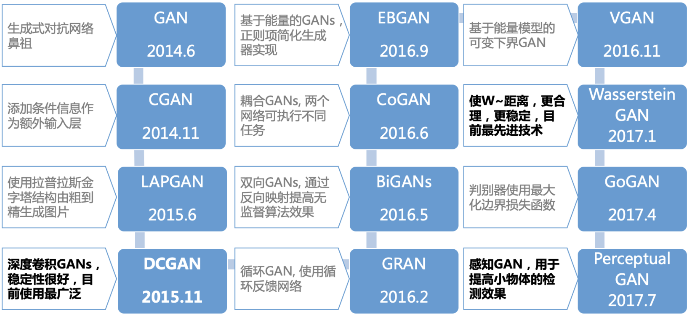
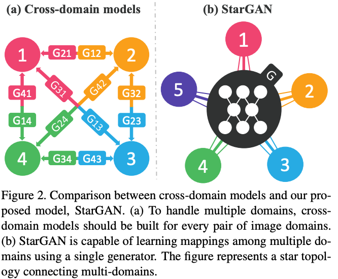
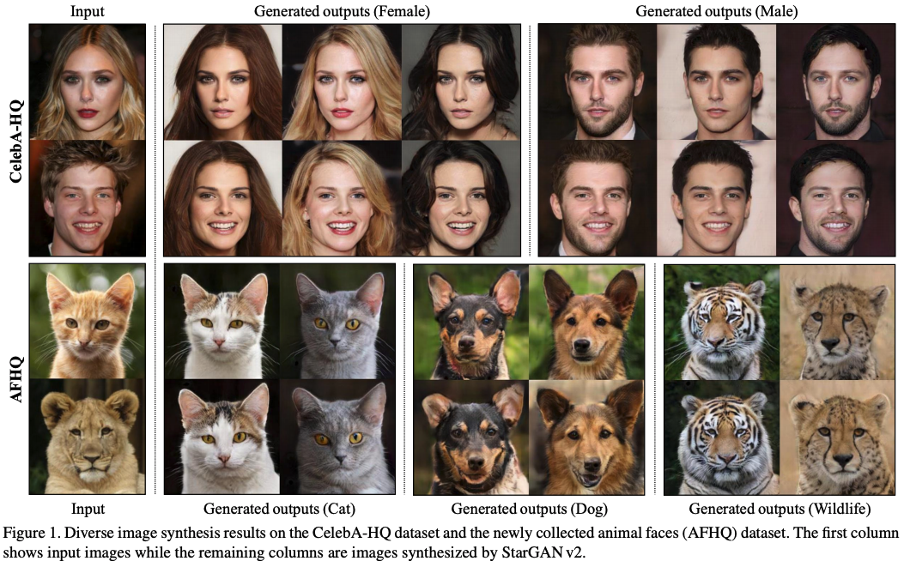
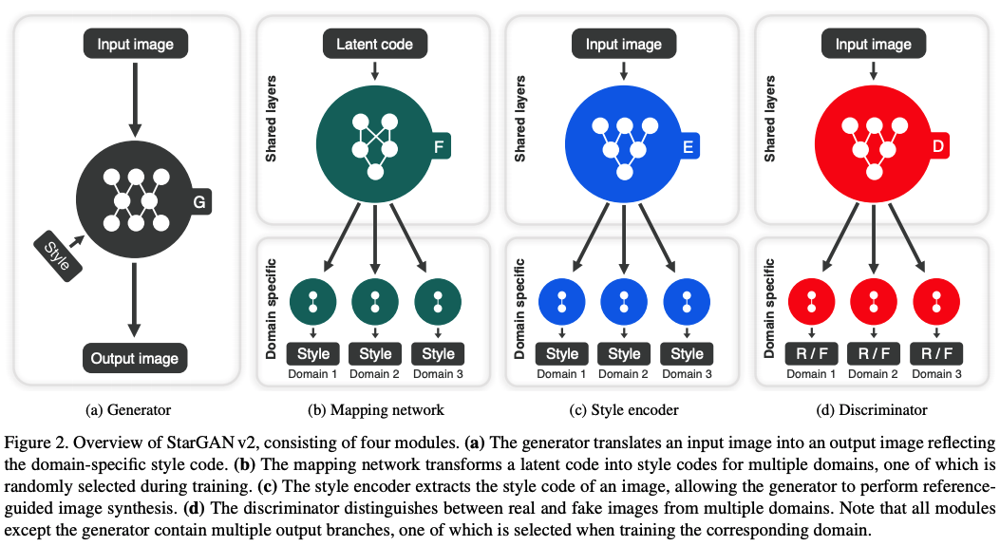
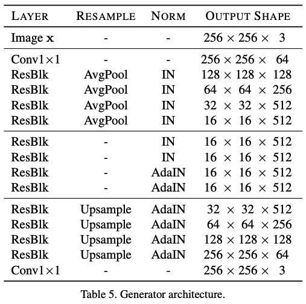
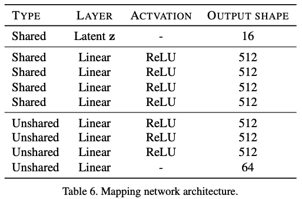
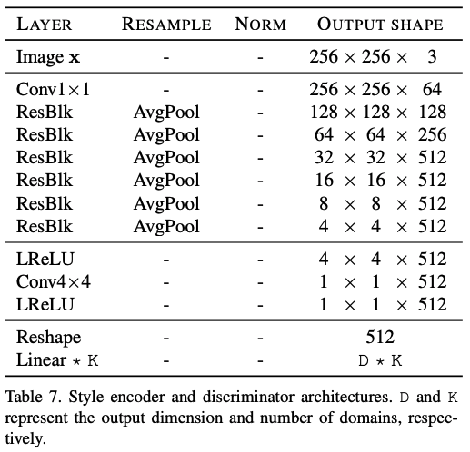
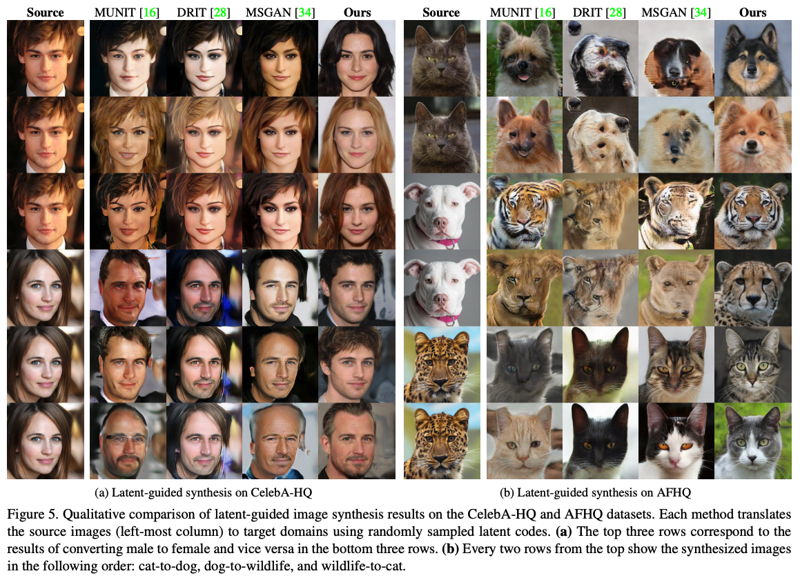
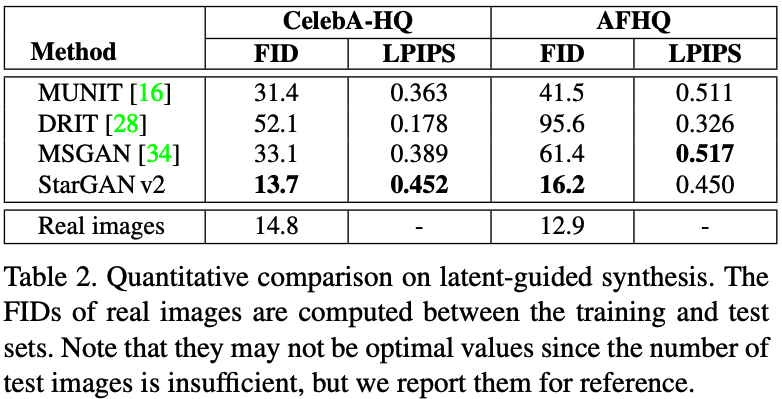
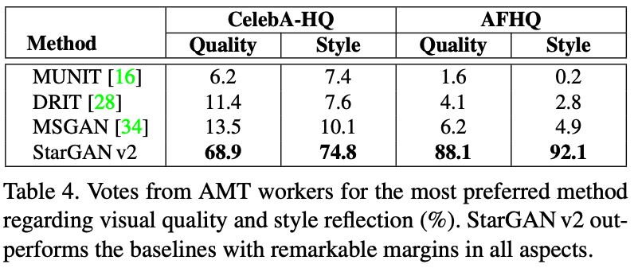

## StarGAN v2学习笔记-基于飞桨PaddlePaddle的论文复现前奏

### 前言

生成式对抗网络([Generative Adversarial Networks](https://arxiv.org/abs/1406.2661))自2016年诞生以来迅速在深度学习领域引起了一波又一波的研究热浪，作为一个极具创新性的研究方法论，初始的GAN虽然很惊艳，但是也具有训练不稳定，存在模式坍塌等问题。后浪们一方面从理论上解决GAN训练的问题，一方面将GAN应用到各种领域。

下图是我在很早之前因为一些需要做的GAN发展历史总结，彼时我只是做了个文献调研，全然没有进行实操，是实实在在的纸上谈兵。



从2017年7月至今，GAN全然没有停下发展的脚步，下图(选自[Paddle论文复现课程](https://aistudio.baidu.com/aistudio/education/preview/493290))中的BigGAN，StyleGAN，Video2Video等更强劲的GAN无一不是获得了大量的关注。


最近参加了百度飞桨深度学习学院的[百度顶会论文复现营](https://aistudio.baidu.com/aistudio/education/group/info/1340)，其中一篇文章是[StarGAN v2](https://arxiv.org/pdf/1912.01865.pdf)。StarGAN虽然没在上图中，但它其实也非常强。[StarGAN](https://arxiv.org/pdf/1711.09020.pdf)是CVPR2018上的一篇论文，做的是图像翻译，官方源码在[这里](https://github.com/yunjey/StarGAN)。图像翻译旨在学习不同视觉域之间的映射，域这个概念在视觉下表示一组图像，这组图像可以将它们分组为视觉上独特的类别，比如一个域全是由狗的图像构成，我们称这个就是一个域，在这个域下全是狗的图像，但是狗又可以细分为拉布拉多、斗牛犬、巴哥、柴犬等这些具有特定风格的图像，在一个大类下的分支它们具有这个类的属性，但是又有自己独特的特征，我们称此为风格，推演到人的话，妆容、胡须、卷发也可以定义为风格。之前的图像翻译工作包括Pix2Pix模型，解决了有Pair对数据的图像翻译问题；CycleGAN解决了Unpaired数据下图像翻译问题。但它们都是针对一对一的问题，如果有k个不同风格，则需要`k*(k-1)`个生成器。StarGAN正是为了解决跨多个域、多个数据集的训练而提出的。在StarGAN中，并不使用传统的fixed translation（(e.g., black-to-blond hair），**而是将域信息和图片一起输入进行训练，并在域标签中加入mask vector，便于不同的训练集进行联合训练**。如下图所示(从图形应该不难理解为啥叫StarGAN了)：



作为升级版的[StarGAN v2](https://arxiv.org/abs/1912.01865)发表在CVPR2020上，相比前代有了新的贡献，在本次论文复现中，我希望用paddlepaddle复现原论文的算法，也算是实战一回GAN。

### 论文概述
前面说了半天为什么要学习StarGAN v2，现在就让我们了解一下文章的概要信息。

标题：**StarGAN v2: Diverse Image Synthesis for Multiple Domains**

作者：`Yunjey Choi*, Youngjung Uh*, Jaejun Yoo*, Jung-Woo Ha`

发表情况：In CVPR 2020. (`* 共同一作`)

论文链接：https://arxiv.org/abs/1912.01865

论文视频：https://youtu.be/0EVh5Ki4dIY

论文摘要：优秀的图像-图像转换模型需要学习不同视觉域之间的映射，要同时满足以下属性：**1）生成图像的多样性和 2）在多个域上的可扩展性。**现有方法一般只能解决这两个问题的其中一个，即要么对于所有域，其呈现的多样性有限，要么需要使用多个模型。StarGAN v2可以同时解决这两个问题，在CelebAHQ面部和新的动物面部数据集（AFHQ）上进行的实验表明，StarGAN v2在图像质量、多样性和可扩展性方面较基线标准和过去的模型均实现了提升。为了更好地评估模型，还发布了AFHQ数据集，该数据集由具有较大域间和域内差异的高质量动物面部图像组成。

效果图：



### 引言和结论

为了解决图片样式的多样性问题，过去的新方法向生成器加入了低维潜代码，从标准的高斯分布中随机采样。但是，由于这些方法仅考虑了两个域之间的映射，因此无法扩展到越来越多的域。例如，具有N个域，这些方法需要训练N（N-1）个生成器来处理每个域之间的转换，从而限制了它们的实际使用。

为了解决可扩展性问题，有研究提出了统一的框架。StarGAN 是最早的模型之一，它使用一个生成器来学习所有可用域之间的映射。生成器将域标签作为附加输入，并学习将图像转换为相应的域。但是，StarGAN仍然需要学习每个域的确定性映射，这可能无法获取数据分布的多模式性质。在给定源图像的情况下，它不可避免地在每个域中产生相同的输出。

StarGAN v2可以同时解决这两方面的问题，可以跨多个域生成不同的图像。该方法以StarGAN为基础，用特定域的样式代码(style code)替换原来的域标签，这些代码可以表示特定域的各种形式。StarGAN v2引入两个模块，一个映射网络(mapping network)和一个样式编码器(style encoder)。前者学习将随机高斯噪声转换为样式代码，后者学习从给定的参考图像中提取样式代码。

最后，利用这些样式代码，生成器会成功地在多个域上学习合成各种图像（图1）。StarGAN v2确实受益于新的样式代码的使用。与目前的SOTA方法相比，我们的方法可扩展到多个域，并且在视觉质量和多样性方面生成了性能更好的结果。 

研究人员还提出了质量更高、变化范围更宽的动物面孔（AFHQ）新数据集，更好地评估域间和域内差异较大的图像-图像翻译模型的性能，并公布了数据集。

### 论文创新点总结

- 设计了 Mapping Network 用于生成style code，摆脱了starGAN域标签的束缚
- 用 Style Encoder 指导 Mapping Network 进行style学习，可以实现目标域下多风格图像的转换
- 发布了动物脸部数据集（AFHQ），有助于相关模型的评测

### 模型框架

StarGANv2由四个模块组成：

**生成器`G`**将输入图像转换为反映特定域风格编码的输出图像；

**映射网络`F`**将潜在代码转换为训练中随机选择的多个域的风格编码；

**风格编码器`E`**提取图像的风格编码，允许生成器执行参照物引导的图像合成；

**鉴别器`D`**从多个域中区分真实图像和虚假图像。



### 网络结构

这里要注意的是映射网络、风格编码器和判别器的输出都是多分支的，因为论文的目的是进行多目标域的转换，这里的多分支就是不同的目标域的表示，对于映射网络和风格编码器，多分支表示的是多个目标域图像的风格表示，对于判别器多分支则是代表不同目标域的判别真假情况，作者在文中用$\Kappa$表示分支数。







### 损失函数

1. **对抗目标**

$L_{adv} = E_{\textbf{x},y}[logD_y(\textbf{x})] + E_{\textbf{x},\tilde{y},\textbf{z}}[log(1-D_\tilde{y}(G(\textbf{x},\tilde{\textbf{s}})))]$

其中$y$表示源图$\textbf{x}$的原始域，表示$\tilde{y}$目标域。
这个损失函数可以体现出对每个域分支训练的细节，源图用以训练域$\tilde{y}$的判别器分支，生成图$G(\textbf{x},\tilde{\textbf{s}})$用以训练域$y$的判别器分支。

2. **风格重构**

    $L_{sty} = E_{\textbf{x},\tilde{y},\textbf{z}}[||\tilde{\textbf{s}}-E_{\tilde{y}}(G(\textbf{x},\tilde{\textbf{s}}))||_1]$

    为了使得生成器在生成图像时利用到style code，这里设置使生成图像的风格编码与输入风格保持一致的目标。

3.  **风格多样性**

    $L_{ds}=E_{\textbf{x},\tilde{y},\textbf{z}_1,\textbf{z}_2}[||G(\textbf{x},\tilde{\textbf{s}})-G(\textbf{x}, \tilde{\textbf{s}}_2)||_1]$

    其中$\tilde{\textbf{s}}_i=F_{\tilde{y}}(\textbf{z}_i), \textbf{z} \in \{1, 2\}$.这个训练目标是最大化两个风格生成图像的距离，这样做是为了激励生成器去探索更多的多样性。

4.  **保留源图特性**

    $L_{cyc}=E_{\textbf{x},y,\tilde{y},\textbf{z}}[||\textbf{x}-G(G(\textbf{x}, \tilde{\textbf{s}}),\hat{\textbf{s}})||_1]$

    其中$\tilde{\textbf{s}}$表示源图经过风格编码器所得。这个损失函数相当于循环重构。

5.  **总损失函数**

    $\min \limits_{G,F,E} \max \limits_{D}  L_{adv}+\lambda_{sty}L_{sty}-\lambda_{ds}L_{ds}+\lambda_{cyc}L_{cyc}$

### 训练细节
在1块V100 GPU上训练了大约3天，具体参数设置如下
`batch_size = 8`
`batch_num = 100k`
对于CelebA-HQ $\lambda_{sty}=1, \lambda_{ds}=1, \lambda_{cyc}=1$ 

对于AFHQ $\lambda_{sty}=1, \lambda_{ds}=2, \lambda_{cyc}=1$

考虑到风格多样性的损失函数没有最优点，所以$\lambda_{ds}$在训练过程中线性缩减到0.

Adam优化器$\beta_1=0, \beta_2=0.99$

学习率$G, D, E$ 的为$10^{-4}$，$F$ 的为$10^{-6}$

### 实验结果

在定性实验对比上可以看到StarGAN v2转换得到的图像更加的逼真和多样性，这个在CelebAHQ和AFHQ数据集上都得到了体现。



定量实验和人力评估上也都展示了优秀的结果。





### 安装使用
详见[官方源码](https://github.com/clovaai/stargan-v2)，这里分享一个我使用中的遇到的问题和解决方案。

在安装依赖库时，官方文档介绍如下：
```
conda create -n stargan-v2 python=3.6.7
conda activate stargan-v2
conda install -y pytorch=1.4.0 torchvision=0.5.0 cudatoolkit=10.0 -c pytorch
conda install x264=='1!152.20180717' ffmpeg=4.0.2 -c conda-forge
pip install opencv-python==4.1.2.30 ffmpeg-python==0.2.0 scikit-image==0.16.2
pip install pillow==7.0.0 scipy==1.2.1 tqdm==4.43.0 munch==2.5.0
```
但我的电脑ubuntu 16.04可能有问题，在conda环境下直接pip安装的包常常安装到系统自带python3.5的路径下，而不是到conda环境路径下，使用下面的命令安装即可解决该问题。
```
python -m pip install opencv-python==4.1.2.30 ffmpeg-python==0.2.0 scikit-image==0.16.2
python -m pip install pillow==7.0.0 scipy==1.2.1 tqdm==4.43.0 munch==2.5.0
```
### 总结
StarGAN v2设计了Mapping Network，将固定的风格编码用更加灵活的映射网络去学习，可以更加丰富的学习到风格表示，同时整个网络的设计也像较于MUNIT得到了一定的精简，结构更加清晰。网络的整体架构参考了StyleGAN的优越的生成效果，在图像转换上进一步得到了提高，同时也处理了图像翻译下将一个域的图像转换为目标域的多种图像，并支持多个目标域的问题。

接下来，用paddlepaddle复现，PaddlePaddle的API跟Pytorch挺像的，希望能够完美复现吧！

**复现过程小结**

- 2020.09.07 复现还是很有难度的，之前边查API边写，干了得有四十个小时以上，还缺wing、r1_reg和kaiming初始化没实现，另外可能还有其它bug，效果图在notebook中，目前还是有问题的。